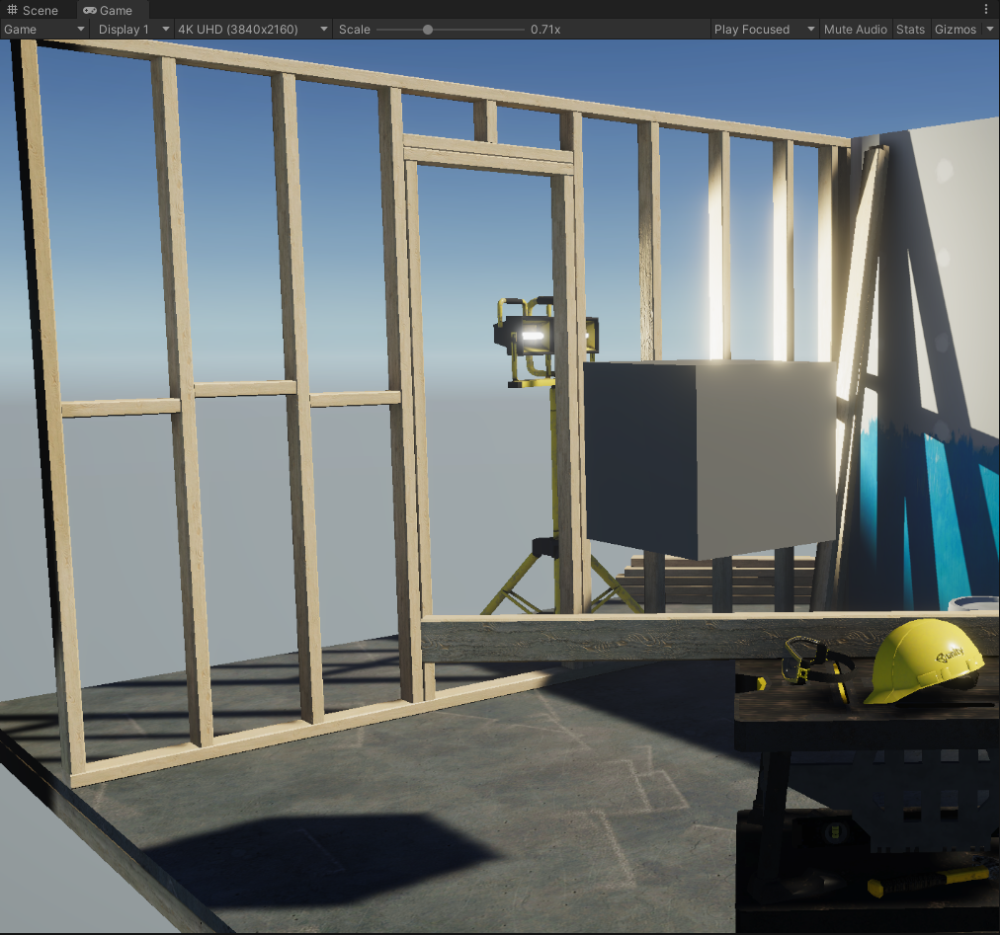
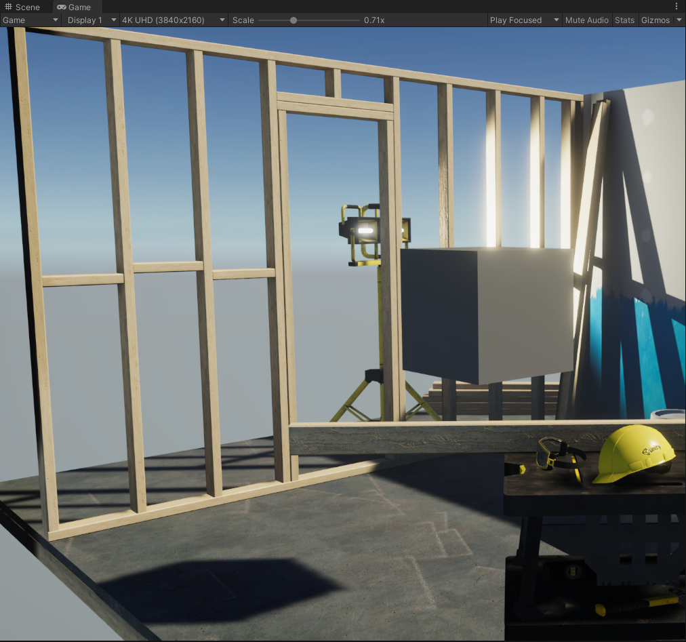

# TAA

A Temporal anti aliasing feature for URP

## Result

<table>
    <tr>
        <td>
 Non AA 
</td>
        <td>
 TAA 
</td>
    </tr>
</table>

## TODO List

- [x] URP Support
- [x] Mobile Support
- [x] Static Scene
- [x] Mitigate Ghosting
- [ ] Mitigate Flickering
- [x] Color Clamping
- [x] Depth rejection
- [ ] Stencil rejection
- [ ] Velocity rejection

## Reference

1. [Temporal AA and the quest for the holy trail](https://www.elopezr.com/temporal-aa-and-the-quest-for-the-holy-trail/)
2. [Temporal Anti Aliasing – Step by Step](https://ziyadbarakat.wordpress.com/2020/07/28/temporal-anti-aliasing-step-by-step/)
3. [深入浅出Temporal Antialiasing](https://zhuanlan.zhihu.com/p/142922246)
4. [TAA原理及OpenGL实现](https://zhuanlan.zhihu.com/p/479530563)

